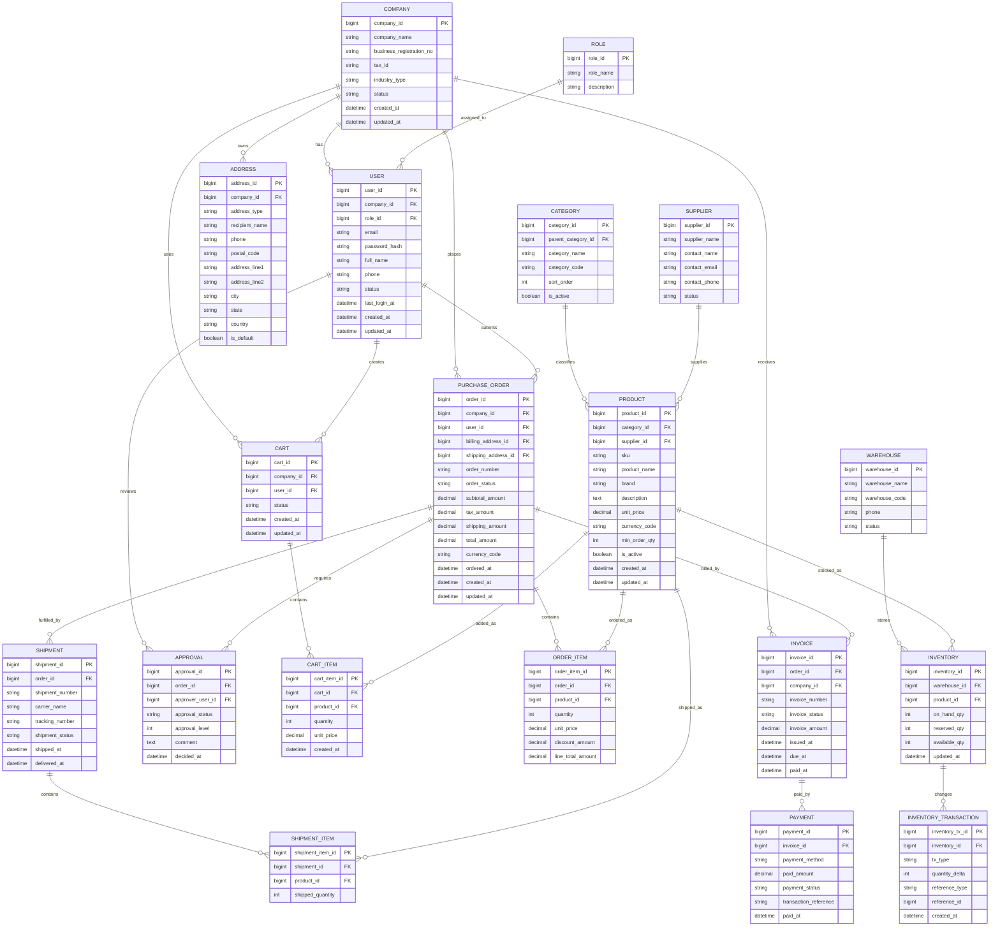

# B2B Office Supply Platform ERD

## Overview

This document describes a baseline entity relationship design for a B2B office supply platform. The model covers company accounts, users, catalog management, purchasing, fulfillment, billing, and inventory movement.

The ERD is intended as a domain reference. Column names and constraints can be adjusted to match the implementation and naming conventions used by the application.

## Core Domain Assumptions

- A customer company can have multiple users.
- Products are grouped by category and supplied by a vendor.
- A company user can maintain a cart and place orders for their company.
- One order contains multiple order items.
- Orders can generate invoices and payments.
- Inventory is tracked per warehouse and product.
- Shipments can be split from a single order if fulfillment is partial.

## Entity Relationship Diagram

## Main Tables

### Company and Access

- `company`: customer organization account.
- `user`: login and operational identity for company employees.
- `role`: access control role such as `ADMIN`, `BUYER`, `APPROVER`, or `ACCOUNTING`.
- `address`: billing, shipping, and office address records owned by a company.

### Product and Supplier

- `category`: product classification with optional parent-child hierarchy.
- `supplier`: vendor or manufacturer providing office supply products.
- `product`: sellable catalog item identified by SKU.

### Shopping and Ordering

- `cart`: active or saved basket for a company user.
- `cart_item`: product lines inside the cart.
- `purchase_order`: submitted order header.
- `order_item`: order line items with price and quantity.
- `approval`: approval workflow records for company purchasing policies.

### Fulfillment and Finance

- `shipment`: shipment batch for an order.
- `shipment_item`: line-level shipped quantities.
- `invoice`: billing record generated for an order.
- `payment`: payment transaction applied to an invoice.

### Inventory

- `warehouse`: physical fulfillment location.
- `inventory`: product stock by warehouse.
- `inventory_transaction`: inventory movement history such as receipt, allocation, release, shipment, and adjustment.

## Recommended Constraints

- Unique: `user.email`
- Unique: `product.sku`
- Unique: `purchase_order.order_number`
- Unique: `invoice.invoice_number`
- Unique: `shipment.shipment_number`
- Unique per warehouse-product pair: `inventory (warehouse_id, product_id)`
- Foreign keys should enforce referential integrity with explicit delete behavior.

## Suggested Status Values

- `company.status`: `ACTIVE`, `SUSPENDED`, `INACTIVE`
- `user.status`: `ACTIVE`, `INVITED`, `LOCKED`
- `product.is_active`: logical catalog visibility flag
- `purchase_order.order_status`: `DRAFT`, `PENDING_APPROVAL`, `APPROVED`, `PLACED`, `PARTIALLY_SHIPPED`, `COMPLETED`, `CANCELLED`
- `approval.approval_status`: `PENDING`, `APPROVED`, `REJECTED`
- `shipment.shipment_status`: `READY`, `SHIPPED`, `DELIVERED`, `RETURNED`
- `invoice.invoice_status`: `ISSUED`, `PARTIALLY_PAID`, `PAID`, `OVERDUE`, `VOID`
- `payment.payment_status`: `PENDING`, `COMPLETED`, `FAILED`, `REFUNDED`

## Notes for Implementation

- If procurement rules are complex, split approval configuration into separate policy tables.
- If pricing differs by customer contract, add `contract` and `contract_price` tables.
- If product variants are needed, introduce `product_variant` under `product`.
- If returns are required, add `return_order` and `return_item`.
- For auditability, consider `created_by`, `updated_by`, and soft delete columns on major tables.
