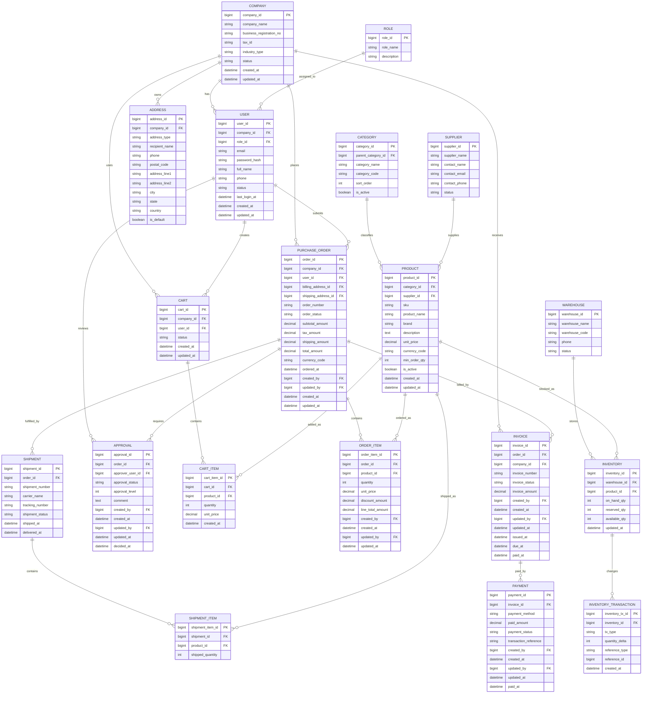

# B2B 사무용품 플랫폼 ERD

## 개요

이 문서는 B2B 사무용품 플랫폼의 기본 엔터티 관계를 정리한 ERD입니다. 범위는 고객사, 사용자, 상품, 주문, 배송, 결제, 재고 도메인을 포함합니다.

이 문서는 도메인 구조를 공유하기 위한 기준 문서입니다. 컬럼명과 제약 조건은 실제 구현에 맞게 조정할 수 있습니다.

## 핵심 도메인 가정

- 하나의 고객사는 여러 사용자를 가질 수 있음
- 상품은 카테고리로 분류되며 공급사가 제공함
- 회사 사용자는 장바구니를 관리하고 소속 회사 명의로 주문할 수 있음
- 하나의 주문은 여러 주문 항목을 포함함
- 주문으로부터 청구서와 결제 정보가 생성될 수 있음
- 재고는 창고와 상품 단위로 관리함
- 부분 출고가 발생하면 하나의 주문이 여러 배송으로 분리될 수 있음

## 엔터티 관계 다이어그램

## 주요 엔티티

### Company and Access

- `COMPANY`: 고객사 조직 정보
- `USER`: 회사 소속 사용자 계정
- `ROLE`: 사용자 권한 정보
- `ADDRESS`: 회사 주소 정보

### Product and Supplier

- `CATEGORY`: 상품 분류 정보
- `SUPPLIER`: 공급사 정보
- `PRODUCT`: 판매 상품 정보

### Shopping and Ordering

- `CART`: 장바구니 정보
- `CART_ITEM`: 장바구니 상품 항목
- `PURCHASE_ORDER`: 주문 기본 정보
- `ORDER_ITEM`: 주문 상품 항목
- `APPROVAL`: 주문 승인 정보

### Fulfillment and Finance

- `SHIPMENT`: 출고 및 배송 정보
- `SHIPMENT_ITEM`: 배송 상품 항목
- `INVOICE`: 청구서 정보
- `PAYMENT`: 결제 정보

### Inventory

- `WAREHOUSE`: 창고 정보
- `INVENTORY`: 재고 현황
- `INVENTORY_TRANSACTION`: 재고 변동 이력

상세 컬럼 설명은 [schema.md](./schema.md)에서 확인할 수 있습니다.

## 감사 추적 적용안

- 적용 대상: `PURCHASE_ORDER`, `ORDER_ITEM`, `APPROVAL`, `INVOICE`, `PAYMENT`
- 기준 사용자 테이블: `USER`
- `created_by`, `updated_by`는 가능한 경우 `USER.user_id`를 참조
- 감사 컬럼 FK는 다이어그램 복잡도를 줄이기 위해 관계선에서 생략
- `ORDER_ITEM`은 관리자 승인 전까지 수정 가능 전제를 반영해 `updated_by`, `updated_at`을 포함
- 주문과 청구 문서는 삭제 대신 상태 전이로 관리
- 관리자 승인 전까지 주문 상세 수정 허용
- 주문 상세 수정 가능 상태: `DRAFT`, `PENDING_APPROVAL`

## 권장 제약 조건

- 고유값: `user.email`
- 고유값: `product.sku`
- 고유값: `purchase_order.order_number`
- 고유값: `invoice.invoice_number`
- 고유값: `shipment.shipment_number`
- 창고-상품 조합별 고유값: `inventory (warehouse_id, product_id)`
- 외래 키는 삭제 정책을 명시하여 참조 무결성을 보장해야 함

## 권장 상태값

- `company.status`: `ACTIVE`, `SUSPENDED`, `INACTIVE`
- `user.status`: `ACTIVE`, `INVITED`, `LOCKED`
- `product.is_active`: 카탈로그 노출 여부를 나타내는 논리 플래그
- `purchase_order.order_status`: `DRAFT`, `PENDING_APPROVAL`, `APPROVED`, `PLACED`, `PARTIALLY_SHIPPED`, `COMPLETED`, `CANCELLED`
- `approval.approval_status`: `PENDING`, `APPROVED`, `REJECTED`
- `shipment.shipment_status`: `READY`, `SHIPPED`, `DELIVERED`, `RETURNED`
- `invoice.invoice_status`: `ISSUED`, `PARTIALLY_PAID`, `PAID`, `OVERDUE`, `VOID`
- `payment.payment_status`: `PENDING`, `COMPLETED`, `FAILED`, `REFUNDED`

## 구현 시 참고 사항

- 구매 승인 규칙이 복잡하다면 승인 설정을 별도의 정책 테이블로 분리
- 고객사 계약별 가격이 다르다면 `contract`, `contract_price` 테이블 추가
- 상품 옵션이나 규격이 필요하다면 `product` 하위에 `product_variant` 도입
- 반품 프로세스가 필요하다면 `return_order`, `return_item` 테이블 추가
- 구매 관련 테이블에는 `created_by`, `updated_by`, `updated_at`을 적용
- 주문 상세는 관리자 승인 전 상태인 `DRAFT`, `PENDING_APPROVAL`까지만 수정 가능하도록 제어
- 주문과 청구 문서는 삭제 대신 상태 전이로 관리
