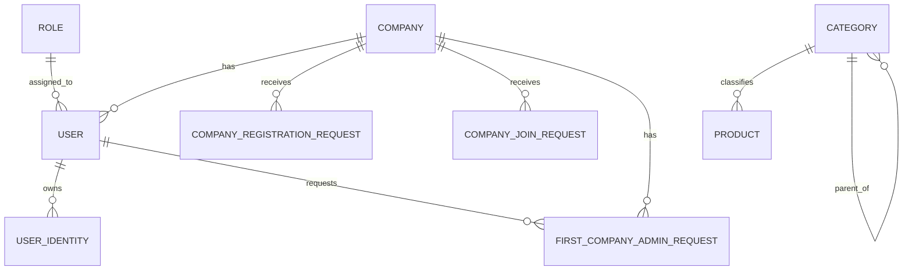
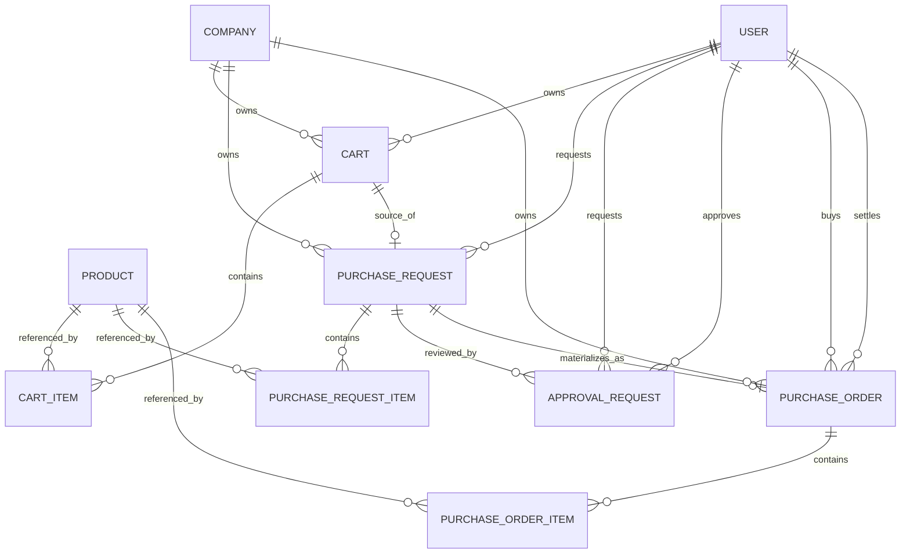

# SupplyHub ERD

이 문서는 현재 구현 기준 엔티티 관계를 설명하는 기준 문서다.
컬럼 의미와 제약은 [schema.md](./schema.md)를 따른다.

## 핵심 계정 및 카탈로그 ERD

## 커머스 ERD

## 관계 해석 메모

- `USER`는 현재 회사 사용자와 플랫폼 운영자 계정을 모두 담는 중심 계정 엔티티다.
- `USER_IDENTITY`는 외부 인증 정보와 내부 사용자 계정을 연결한다.
- `FIRST_COMPANY_ADMIN_REQUEST`는 첫 회사 관리자 권한 확장 요청을 표현한다.
- `COMPANY_REGISTRATION_REQUEST`는 신규 회사 등록 요청을 표현한다.
- `COMPANY_JOIN_REQUEST`는 기존 회사 참여 요청을 표현한다.
- 카탈로그 가격은 `PRODUCT`에 있고, 거래 단계에서는 각 item 테이블로 스냅샷 복사된다.
- 현재 커머스 흐름은 `CART -> PURCHASE_REQUEST -> APPROVAL_REQUEST -> PURCHASE_ORDER` 순서를 따른다.
- `PURCHASE_ORDER`는 `DRAFT -> PENDING_PLATFORM_APPROVAL -> PAYMENT_PENDING/REJECTED` 또는 `DRAFT/PENDING_PLATFORM_APPROVAL -> CANCELLED` 상태 전이를 가진다.
- `PURCHASE_ORDER.PAYMENT_PENDING`은 `PLATFORM_ADMIN` 승인으로 주문이 확정된 직후의 결제 대기 상태를 뜻한다.
- 주문확정 이후에는 `PAYMENT_PENDING -> PAID -> READY_TO_SHIP -> SHIPPED -> DELIVERED` 흐름으로 확장한다.
- `PAID` 이후 배송 단계 전이는 `PLATFORM_ADMIN`이 운영 화면에서 처리한다.

## 현재 범위 밖

- 결제
- 배송
- 재고
- 정산
- 다단계 승인
## Status History Note

- `PURCHASE_ORDER_STATUS_HISTORY` stores append-only order status transitions.
- `purchase_orders` still keeps the latest status plus operational timestamps for fast reads.

## Settlement 1st Phase

- Settlement state is stored on `PURCHASE_ORDER`.
- `settled_by_user_id` points to the `USER` who completed settlement.
- Current scope does not introduce a separate settlement batch entity.
